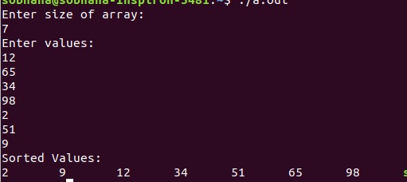

# DSLAB 
Different data structures using c programming language 
# Experiment Lists: 
##### 5.Polynomial addition and multiplication using linked list  

##### 6.Stack using 1D array 

##### 7.Stack using linked list 

##### 8.Infix to postfix using stack  

##### 9.Evaluation of postfix using stack
 
##### 10.Queue using linkedlist and array 

##### 11.Quick Sort(Recursive) 

##### 12.Merge Sort (Recursive) 

##### 13.Quick Sort & Merge Sort(Non-recursive) 
 
##### 14.Heap Sort
